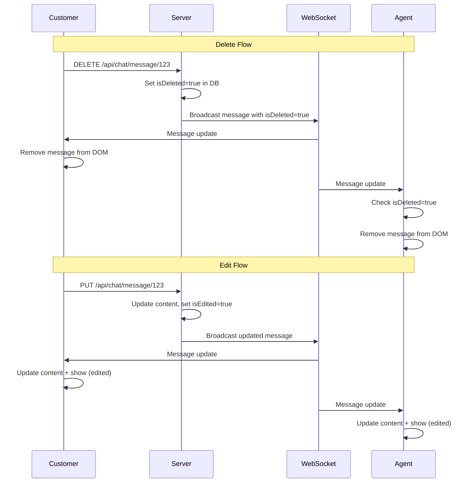

# Agent Real-Time Sync for Deleted Messages Fix

## Problem
When a customer deleted a message in their chat, the agent could still see the deleted message. The agent's interface was not handling deleted messages properly.

## Root Cause
The `displayMessage()` function in `agent-chat.html` was missing logic to:
1. Check if a message is deleted (`isDeleted` flag)
2. Remove deleted messages from the DOM
3. Update edited messages properly
4. Show "(edited)" indicator

## Solution Applied

### Updated agent-chat.html

#### 1. Enhanced displayMessage() Function

**Added deletion handling:**
```javascript
// Check if message is deleted
if (message.isDeleted) {
    // Find and remove the message from DOM if it exists
    const existingMsg = document.querySelector(`[data-message-id="${message.id}"]`);
    if (existingMsg) {
        existingMsg.remove();
    }
    return;
}
```

**Added edit update handling:**
```javascript
// Check if message already exists (for edit updates)
const existingMsg = document.querySelector(`[data-message-id="${message.id}"]`);
if (existingMsg) {
    // Update existing message content
    const contentDiv = existingMsg.querySelector('.message-content');
    if (contentDiv) {
        contentDiv.textContent = message.content;
        
        // Add edited indicator if needed
        if (message.isEdited) {
            const indicator = document.createElement('span');
            indicator.classList.add('edited-indicator');
            indicator.textContent = ' (edited)';
            contentDiv.appendChild(indicator);
        }
    }
    return;
}
```

**Added data-message-id attribute:**
```javascript
messageContainer.setAttribute('data-message-id', message.id);
```

**Added message-content wrapper:**
```javascript
const messageContent = document.createElement('div');
messageContent.classList.add('message-content');
messageContent.textContent = message.content;

// Add edited indicator if message was edited
if (message.isEdited) {
    const editedIndicator = document.createElement('span');
    editedIndicator.classList.add('edited-indicator');
    editedIndicator.textContent = ' (edited)';
    messageContent.appendChild(editedIndicator);
}
```

#### 2. Added CSS Styles

```css
.message-content { word-wrap: break-word; }
.edited-indicator { 
    font-size: 0.7rem; 
    opacity: 0.7; 
    font-style: italic; 
    color: #718096; 
}
```

## How It Works Now

### When Customer Deletes a Message:

1. **Customer side** (live-chat.html):
   - Customer clicks "Delete" button
   - DELETE request sent to `/api/chat/message/{messageId}`
   - Backend marks `isDeleted = true`
   - Backend broadcasts updated message via WebSocket
   - Customer's message disappears

2. **Agent side** (agent-chat.html):
   - Agent receives WebSocket update
   - `displayMessage()` checks `message.isDeleted === true`
   - Finds message by `data-message-id` attribute
   - **Removes message from DOM**
   - Agent no longer sees the deleted message ✅

### When Customer Edits a Message:

1. **Customer side**:
   - Customer clicks "Edit" button
   - PUT request sent with new content
   - Backend updates content and sets `isEdited = true`
   - Backend broadcasts updated message via WebSocket
   - Customer sees updated message with "(edited)" label

2. **Agent side**:
   - Agent receives WebSocket update
   - `displayMessage()` finds existing message by ID
   - **Updates content** in place
   - **Adds "(edited)" indicator**
   - Agent sees the edited message ✅

## Real-Time Synchronization Flow



## Testing Instructions

### Test Real-Time Delete

1. **Setup:**
   - Browser 1: Login as customer → `/live-chat`
   - Browser 2: Login as agent → `/agent/chat`

2. **Customer sends message:**
   - Browser 1: Type "Hello, I need help" → Send
   - Browser 2: Verify agent sees the message

3. **Customer deletes message:**
   - Browser 1: Hover over message → Click "Delete" → Confirm
   - Browser 1: ✅ Message disappears
   - **Browser 2: ✅ Message should also disappear immediately**

4. **Check console:**
   - Browser 2 (Agent) should show:
   ```
   📩 New message received: {...}
   💬 Displaying message: {...}
     → Message is deleted, removing from DOM
     → Deleted message removed
   ```

### Test Real-Time Edit

1. **Customer sends message:**
   - Browser 1: Type "Hello" → Send
   - Browser 2: Verify agent sees "Hello"

2. **Customer edits message:**
   - Browser 1: Hover over message → Click "Edit"
   - Browser 1: Change to "Hello there" → OK
   - Browser 1: ✅ Message updates with "(edited)"
   - **Browser 2: ✅ Message should update with "(edited)"**

3. **Check console:**
   - Browser 2 (Agent) should show:
   ```
   📩 New message received: {...}
   💬 Displaying message: {...}
     → Message exists, updating content
     → Added edited indicator
     → Message updated
   ```

## Browser Console Logs

### Successful Delete (Agent Side)
```
📩 New message received: {"id":123,"content":"Hello","isDeleted":true,...}
💬 Displaying message: Object {id: 123, isDeleted: true, ...}
  → Message is deleted, removing from DOM
  → Deleted message removed
```

### Successful Edit (Agent Side)
```
📩 New message received: {"id":123,"content":"Hello there","isEdited":true,...}
💬 Displaying message: Object {id: 123, isEdited: true, ...}
  → Message exists, updating content
  → Added edited indicator
  → Message updated
```

## Expected Behavior

### ✅ Delete Synchronization
- Customer deletes → **Agent sees deletion immediately**
- Message disappears from both chat windows
- No duplicates or ghost messages

### ✅ Edit Synchronization
- Customer edits → **Agent sees edit immediately**
- Updated content appears in both windows
- "(edited)" indicator shows in both windows
- No duplicate messages

### ✅ Visual Consistency
Both customer and agent see:
- Same message content
- Same edited indicators
- Same deletion state
- Real-time updates without refresh

## Files Modified

1. ✅ `agent-chat.html`
   - Updated `displayMessage()` function
   - Added deletion check and removal logic
   - Added edit update logic
   - Added `data-message-id` attribute
   - Added `message-content` wrapper
   - Added CSS for `.message-content` and `.edited-indicator`

## Benefits

1. ✅ **Real-time synchronization** - All participants see the same state
2. ✅ **No ghost messages** - Deleted messages disappear for everyone
3. ✅ **Edit transparency** - Everyone sees edits with indicators
4. ✅ **Better UX** - Seamless real-time updates
5. ✅ **Consistency** - Customer and agent interfaces behave the same

## Troubleshooting

### Issue: Agent still sees deleted messages

**Check:**
1. Verify WebSocket is connected (console should show "✅ WebSocket Connected")
2. Check if agent is subscribed to correct session topic
3. Verify `message.isDeleted` is `true` in WebSocket message
4. Check console for "Message is deleted, removing from DOM" log

**Solution:**
- Refresh agent page
- Check server logs for WebSocket broadcast
- Verify DTO includes `isDeleted` field

### Issue: Edited messages not updating

**Check:**
1. Verify `message.id` is present in WebSocket message
2. Check if `data-message-id` attribute exists on message elements
3. Verify `message.isEdited` is `true`
4. Check console for "Message exists, updating content" log

**Solution:**
- Verify DTO includes `id` and `isEdited` fields
- Check querySelector is finding the right element
- Verify `.message-content` class exists

## Conclusion

The agent interface now properly handles real-time message deletions and edits, ensuring perfect synchronization between customer and agent chat windows. All participants always see the current state of the conversation.

